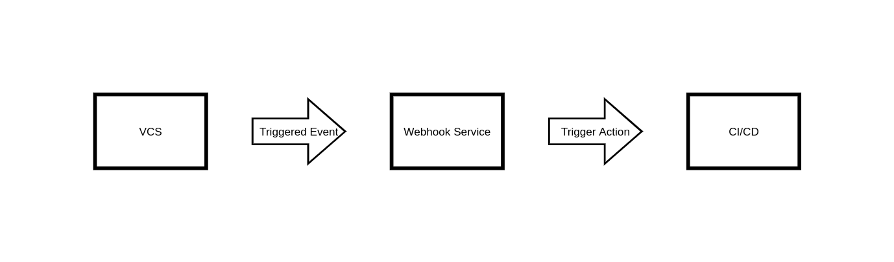

# BitbucketEventHandler
Python handler for BitBucket events. As the name of the repository suggests, this project will support only Bitbucket as VCS component of the flow bellow.

## Flow

There are 3 components in the flow:
* VCS (version control system) - Bitbucket, GitHub etc.
* Webhook Service - Zapier, HostedHooks etc.
* CI/CD (Continous Integration/Continous Delivery) - Jenkins, CircleCI etc.

At the first stage, a developer does an action (commit, push, merge, ...) in VCS. This VCS action triggers an event, which is sent to a Webhook service. Webhook service provides you with means to process an event and send a response. In our case, we will respond to CI/CD associated with our VCS and trigger an action (rebuild project, trigger new pipeline, ...). 

## Tech stack
As you can see in the Flow section, there are 3 components required. At the moment, supported technologies are:
* VCS: Bitbucket
* Webhook Service: AWS Lambda
* CI/CD: CircleCI

## Use cases
Supported Bitbucket events:
* Pull request merged

Supported CircleCI actions:
* Trigger new pipelines on branches with Open PRs to the same destination branch as the Merged PR had.

## Setup
Follow the setup procedure as follows:
1. Create API Keys.
2. Set up your \<Webhook-Service> + <CI/CD> pair.
3. Create Bitbucket Webhook.

### Create API keys
**Create Bitbucket App Password:**
1. Sign in to the Bitbucket.
2. Go to your "Personal settings".
3. Under "ACCESS MANAGEMENT" section, go to "App passwords" and click there on "Create app password" button.
4. Select permissions according to your use case and click on "Create".
5. Save your App password in a safe place.

**Create CircleCI Personal API Token:**
1. Sign in to the CircleCI.
2. Go to your "User settings".
3. Click on "Personal API Tokens" and there click on "Create New Token" button.
4. Name accordingly your token and hit "Add API Token".
5. Save your API token in a safe place.

### AWS Lambda + CircleCI
> **NOTE:** To create Lambda function, you need to have proper permissions in AWS Lambda and AWS API Gateway.

**Create a function:**
1. Sign in to the AWS Management console.
2. Go to Lambda service.
3. Click on "Create function" button.
4. Select "Author from scratch" option.
5. Name your function.
6. Select Python3.8 runtime.
7. Click on the "Create function" button.  

**Add HTTP trigger:**
1. On the function page, click on the "Add trigger" button.
2. Select "API Gateway" from the dropdown menu.
3. Next, from the second dropdown menu, choose "Create an API".
4. Select "HTTP API" API type.
5. Select "Open" security from the third dropdown menu.
6. Click on the orange "Add" button.

**Upload code:**
1. Download the [latest aws package](https://github.com/PythonMove/BitbucketEventHandler/releases/download/v0.0.1/aws_deployment.zip) from releases. 
2. On the function page, under "Code" section, click on "Upload from" button and choose ".zip file" option.
3. Upload the "aws_deployment.zip" you have downloaded in the first step.

**Set Lambda Environment variables:**
1. On the function page, under "Configuration" section, click on "Environment variables".
2. Click on the "Edit" button and add following variables with your values:
```
BITBUCKET_API_URL	https://api.bitbucket.org
BITBUCKET_APP_PASSWORD	<Your-Bitbucket-App-Password>
BITBUCKET_USERNAME	<Your-Bitbucket-Username>
CIRCLECI_API_TOKEN	<Your-Personal-CircleCI-API-Token>
CIRCLECI_PROJECT_SLUG   bb/<Your-CircleCI-Organization-Name>/<CircleCI-Project-Name>
```
3. Click on "Save" button.


### Create Bitbucket Webhook
> **NOTE:** In order to setup Bitbucket Webhook, you need to have administrator access to a repository.

1. Go to your Bitbucket repository.
2. Click on "Repository settings".
3. Click on "Webhooks" in the menu.
4. Click on "Add webhook", type in title and URL you got from your Webhook Service.
5. Select Triggers according to your use case and click on the "Save" button.
